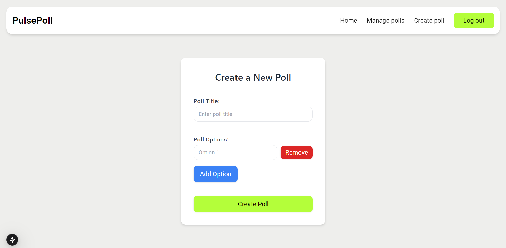

# Polling Application

## Frontend Documentation

### Overview
The frontend is built using **Next.js** and styled with **Tailwind CSS**. It provides an interactive interface for users to create and participate in polls. Authentication is integrated using **Passkeys**.

### Features
- Passkey registration and authentication.
- User-friendly poll creation and participation.
- Real-time poll results display.


### Configuration
- **Environment Variables:**
  - `NEXT_PUBLIC_API_BASE_URL`: Backend API base URL.
---

### Local Setup

#### Setup Steps

1. **Clone the repository:**
   ```bash
    git clone https://github.com/Azeem-0/polling_application_frontend.git
    cd polling_application_frontend
   ```

2. **Install dependencies**
    ```bash 
      npm install
    ```
3. **Set up environment variables:**
    ```bash
    NEXT_PUBLIC_API_BASE_URL=<your-backend-api-url>
    ```
4. **Run the server:**
  ```bash
    npm run dev
  ```
5. **Access the application:**
    - Once the server is running, you can access the frontend application in your browser at http://localhost:3000.


### Application UI Overview.

##### Authentication Page


#### Home Page


#### Single Poll Details 


#### Poll Statistics 


#### Poll Creation 


#### Manage Poll
